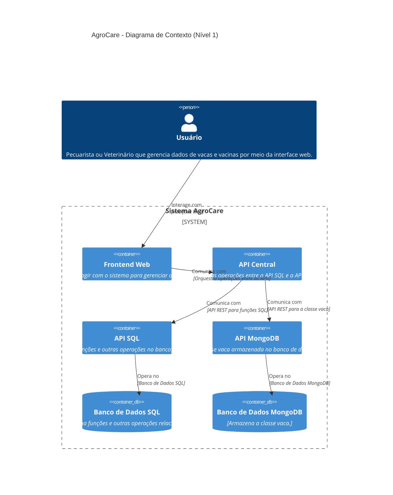
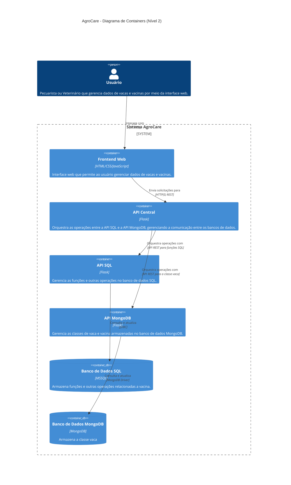
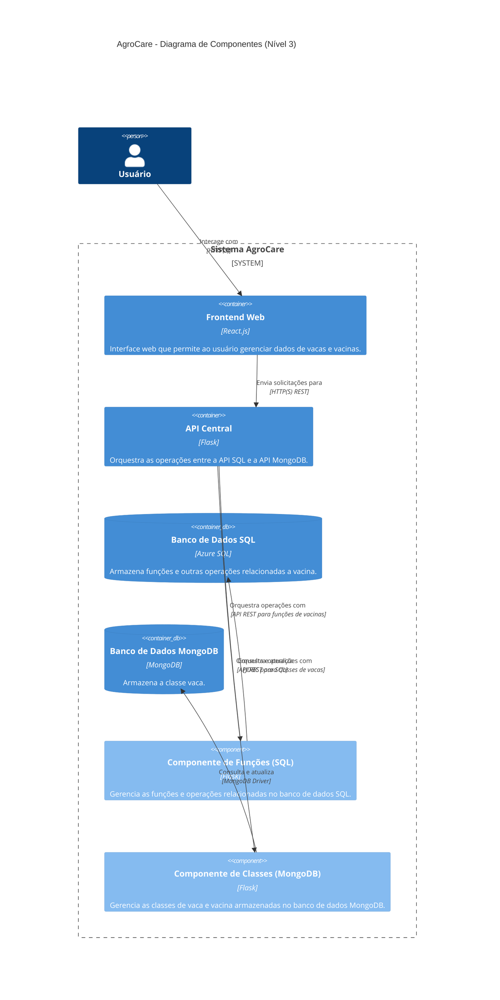
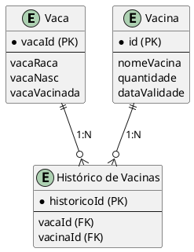

## Alunos: Beatriz Petry, Guilherme Vilela, Julia Engels, Lohan Berg e Mariana Camily
- Links Importantes: 

    Repositórios: 

    https://github.com/maricamily/agrocareAPI (privado - prints  de evidência no último repositório)

    https://github.com/maricamily/functionsAPI

    https://github.com/maricamily/agrocareBFF
## 1.0 Introdução e Metas

### 1.1 Visão Geral do Sistema

O sistema de gerenciamento de bovinos e vacinas (AgroCare) foi projetado para rastrear e gerenciar informações sobre o rebanho e o histórico de vacinação em fazendas. Ele inclui dois módulos principais: um focado no monitoramento dos bovinos (dados armazenados no MongoDB) e outro para o registro e controle das vacinas aplicadas (dados armazenados no Azure Functions com SQL). A integração entre as vacinas e as vacas é realizada por meio de um BFF (Backend for Frontend).

### 1.2 Metas e Restrições

**Metas:** Facilitar o controle e a gestão do rebanho, garantir a conformidade com as regulamentações sanitárias e melhorar a eficiência na administração das vacinas.  
**Restrições:** O sistema é exclusivamente para a gestão de bovinos e vacinas, e a arquitetura foi desenhada para lidar com a conexão entre as vacinas no SQL e as vacas no MongoDB, utilizando um BFF.

### 1.3 Stakeholders

- Proprietário da Fazenda
- Veterinário
- Auxiliar de Fazendeiro

### 1.4 Contexto do Sistema

O sistema será utilizado em fazendas, com uma interface acessível tanto via desktop quanto em dispositivos móveis. Ele se integrará ao sistema de gestão de fazendas existente para sincronizar dados de inventário e de vendas. Caso não haja um sistema "pai", o AgroCare terá capacidade para desempenhar esse papel.

## 2.0 Regras e Restrições

### 2.1 Restrições Técnicas

O sistema deve ser desenvolvido utilizando Flask, com integração entre MongoDB (para vacas) e SQL (para vacinas) via Azure Functions. A comunicação entre os bancos de dados será feita por um BFF. O sistema deverá funcionar de maneira local, permitindo o acesso apenas quando conectado à internet.

### 2.2 Restrições de Processo

O desenvolvimento deve seguir uma metodologia ágil como Scrum, com sprints de duas semanas e revisões regulares com os stakeholders, permitindo feedback contínuo.

## 3.0 Visão de Contexto

### 3.1 Escopo do Sistema

O escopo do sistema será única e exclusivamente o gerenciamento de bovinos e suas vacinas. As vacas são gerenciadas no MongoDB e as vacinas no SQL via Azure Functions. O sistema contemplará dois "DePara", relacionando as vacas com as vacinas através de um BFF, gerando tabelas para a administração da saúde bovina.

### 3.2 Contexto de Negócio

Existem três tipos de interações no sistema: o proprietário da fazenda, que realizará o cadastro e a administração geral das fazendas no sistema; o veterinário, que será responsável por cadastrar as vacinas e atualizar o status de vacinação dos bovinos (conectando vacinas e vacas via BFF); e o auxiliar de fazendeiro, que realizará a manutenção geral do sistema e o cadastro dos bovinos.

### 3.3 Contexto Técnico

Os canais e protocolos escolhidos incluem dois sistemas de banco de dados: MongoDB, hospedado na nuvem Azure, para gerenciamento de dados das vacas, e SQL (Azure Functions) para gerenciamento das vacinas. A integração entre os sistemas será via API RESTful, utilizando JSON para a troca de dados, e a conexão entre os bancos será feita por um BFF.

## 4.0 Visão de Solução

### 4.1 Decisões de Tecnologia

Foi escolhido o Azure Functions como plataforma de backend para o módulo de vacinas devido à sua natureza serverless e de alta escalabilidade. As vacas são armazenadas no MongoDB, com a comunicação entre os dois bancos realizada por um BFF. Será utilizada REST API para a comunicação entre o front e o back, e o sistema será desenvolvido utilizando Flask.

### 4.2 Decisões sobre a Decomposição de Nível Superior do Sistema

O sistema utiliza uma arquitetura serverless para o módulo de vacinas no Azure Functions e MongoDB para o módulo de bovinos. A integração entre ambos será realizada pelo BFF, que gerencia a comunicação entre os dois bancos. O padrão CRUD para vacas e vacinas será implementado para um alto controle sobre o gerenciamento de gado.

### 4.3 Decisões sobre como Atingir as Principais Metas de Qualidade

A escolha de uma arquitetura serverless para o módulo de vacinas e MongoDB para vacas garante que o sistema escale de forma automática e eficiente. O uso de um BFF facilita a comunicação entre os dois sistemas e mantém a segurança e integridade dos dados.

### 4.4 Decisões Organizacionais Relevantes

O desenvolvimento segue uma abordagem ágil, permitindo adicionar rapidamente funcionalidades conforme necessário.

## 5.0 Construção

### 5.1 Visão de Contexto

O sistema AgroCare pode ser dividido em três principais camadas:

- Camada de Interface de Usuário
- Camada de Lógica de Negócio (com suporte do BFF para conectar MongoDB e SQL)
- Camada de Persistência

### 5.2 Camada de Interface de Usuário

Interface que permite aos usuários gerir os dados das vacas e vacinas, e também faz chamadas às APIs para realizar operações de CRUD e consultas.
Utiliza HTML, CSS, JavaScript.

### 5.3 Camada de Lógica de Negócio

A lógica de negócio inclui operações CRUD para o gerenciamento de vacas (armazenadas no MongoDB) e vacinas (armazenadas no SQL), com o BFF garantindo a integração entre os dois sistemas.

### 5.4 Camada de Persistência

O sistema tem dois bancos de dados: um para dados estruturados (vacinas em SQL) e outro para dados não estruturados (vacas em MongoDB), funcionando juntos por meio do BFF para armazenar as informações do sistema.

## 6.0 Visão de Execução

## 6.1 Casos de Uso Importantes

Caso de Uso: Criação de uma Nova Vaca  
O criador de gado acessa a interface do AgroCare (frontend web ou app móvel) e insere os dados de uma nova vaca. A interface envia uma requisição HTTP (POST) para a API REST do AgroCare, que valida os dados e armazena a vaca no MongoDB.

Caso de Uso: Aplicação de Vacina  
O veterinário acessa o AgroCare, seleciona a vaca e insere os dados da vacina, enviando uma requisição HTTP (POST) para a API REST, que armazena os dados no banco SQL. O BFF faz a comunicação entre as vacinas no SQL e a vaca no MongoDB.

## 6.2 Operação e Administração

### Lançamento e Inicialização

- Desenvolvimento: A equipe faz deploy das Azure Functions e do frontend via Azure DevOps.
- Deploy no Azure: As Azure Functions e bancos de dados são hospedados na Azure.
- Monitoramento: O Azure Monitor registra métricas e falhas.

### Parada e Reinicialização

- Azure Functions e MongoDB podem ser temporariamente desativados para manutenção e reimplantados sem impacto significativo nos dados.

## 7.0 Conceitos de Implementação

### 7.1 Infraestrutura Técnica

O AgroCare está dividido em componentes para vacas (MongoDB) e vacinas (SQL no Azure Functions), com integração via BFF. A arquitetura é distribuída, sendo serverless no backend de vacinas.

### 7.2 Mapeamento de Blocos de Construção

- **Módulo de Bovinos**: CRUD para vacas no MongoDB.
- **Módulo de Vacinas**: CRUD para vacinas no SQL via Azure Functions.
- **BFF**: Middleware que conecta vacinas e vacas entre os dois sistemas.

### 7.3 Considerações de Implementação

O uso do BFF garante a consistência entre os dados de vacinas (SQL) e vacas (MongoDB).

## 8.0 Crosscutting Concepts

### 8.1 Modelos de Domínio

- Vaca: Armazenada no MongoDB, com atributos como ID, nome, idade, etc.
- Vacina: Armazenada no SQL, com atributos como ID, nome, quantidade, etc.

### 8.2 Padrões Arquiteturais e de Design

Arquitetura serverless com Azure Functions para vacinas e REST APIs para integração com MongoDB via BFF.

## 9.0 Decisões de Arquitetura

### 9.1 Decisões Críticas de Arquitetura

#### 9.1.1 Separação de Dados: Vacas (MongoDB) e Vacinas (SQL via Azure Functions)

**Decisão**: Vacas são armazenadas no MongoDB e vacinas no SQL, com integração via BFF (Backend for Frontend).

**Motivação**: MongoDB é ideal para dados não estruturados (vacas), enquanto SQL garante consistência para os dados estruturados (vacinas).

**Consequências**:
- **Positivas**: Melhor desempenho e organização de dados. Escalabilidade adequada para cada tipo de dado.
- **Negativas**: Complexidade adicional na integração e sincronização entre os bancos de dados.

#### 9.1.2 Uso de Azure Functions para Vacinas

**Decisão**: Azure Functions gerencia o backend do módulo de vacinas.

**Motivação**: A arquitetura serverless oferece escalabilidade automática e otimizada.

**Consequências**:
- **Positivas**: Escalabilidade automática e baixo custo operacional.
- **Negativas**: Potenciais latências durante "cold starts".

#### 9.1.3 BFF (Backend for Frontend) para Integração

**Decisão**: O BFF é usado para integrar os dados de vacas e vacinas.

**Motivação**: Facilita a comunicação entre os dois bancos de dados e centraliza as regras de negócio.

**Consequências**:
- **Positivas**: Integração simplificada e melhor segurança de dados.
- **Negativas**: Adiciona um ponto de falha e aumenta a complexidade de manutenção.

### 9.2 Decisões de Arquitetura Menos Críticas

#### 9.2.1 Escolha do Flask como Framework Backend

**Decisão**: Flask foi escolhido como framework backend.

**Motivação**: É leve, flexível e bem integrado com MongoDB e Azure Functions.

#### 9.2.2 Uso de MongoDB para Dados de Bovinos

**Decisão**: MongoDB foi escolhido para armazenar os dados das vacas.

**Motivação**: Flexibilidade para lidar com dados não estruturados e grande volume de informações.

## 10.0 Qualidade

### 10.1 Requisitos de Qualidade

1. **Escalabilidade**: Serverless no Azure Functions e MongoDB escalando automaticamente.
2. **Disponibilidade**: Sistema deve estar disponível, com sincronização via BFF entre SQL e MongoDB.
3. **Segurança**: Autenticação segura entre os módulos.
4. **Desempenho**: Resposta CRUD em menos de 500 ms.

### 10.3 Árvore de Qualidade

Escalabilidade

- Responde bem a picos de carga.
- Escala automaticamente.

Disponibilidade

- Garantia de 99% de uptime.
- Redundância geográfica.

Segurança

- Niveis de Permissões

Desempenho

- Tempo de resposta < 500 ms para CRUD.

Requisitos de Menor Prioridade

- Manutenibilidade (facilidade de manutenção e atualização).
- Usabilidade da interface.

## 11.0 Visão de Riscos e Dívidas Técnicas

### 11.1 Riscos Técnicos

1. Acesso Não Autorizado: Exposição de dados sensíveis.

2. Desempenho Degradado: Consultas lentas e operações de CRUD podem prejudicar a experiência do usuário.

3. Escalabilidade Insuficiente: O sistema pode não conseguir lidar com picos inesperados de uso, resultando em lentidão ou falhas

## 12.0 Glossário
Não Aplicável.

## Diagramas C4 Model**

**Driagrama de Nível 1:**

**Diagrama de Nível 2:**

**Diagrama de Nível 3:**

**Diagrama de Entidade-Relacionamento**
